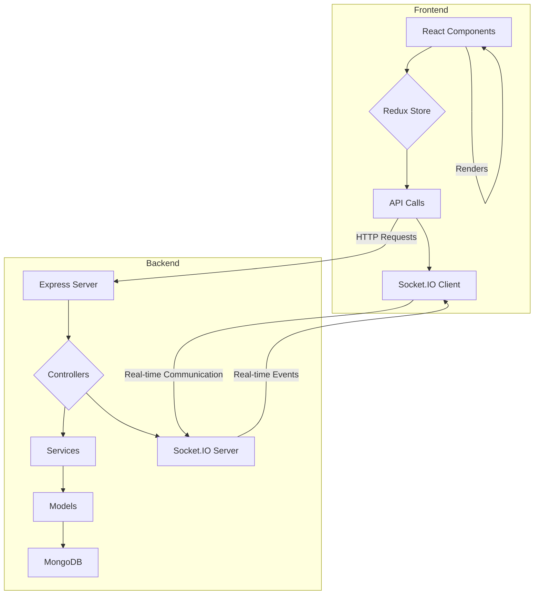

# Ticket Dashboard Application

This is a full-stack ticket dashboard application with real-time updates, built with Node.js, Express, TypeScript, React, and Socket.IO.

## Features

*   Email-based OTP login (no password required).
*   Create, Read, Update, and Delete projects and tickets.
*   Real-time updates for all connected clients.
*   Superuser mode to view created/updated by information for tickets.
*   Notifications for ticket updates (UI notifications for online users, email notifications for offline users).

## Technologies Used

**Backend:**

*   Node.js
*   Express
*   TypeScript
*   MongoDB (Mongoose)
*   Socket.IO
*   Nodemailer
*   InversifyJS (Dependency Injection)

**Frontend:**

*   React
*   TypeScript
*   Vite
*   Redux Toolkit
*   React Router
*   Axios
*   Socket.IO Client
*   CSS Modules
*   @hello-pangea/dnd

## Architecture



## Getting Started

### Prerequisites

*   Node.js (v14 or later)
*   npm
*   MongoDB

### Installation

1.  **Clone the repository:**

    ```bash
    git clone <repository-url>
    ```

2.  **Navigate to the project root directory:**

    ```bash
    cd "Ticket Dashboard"
    ```

### Backend Setup

1.  **Navigate to the backend directory:**

    ```bash
    cd backend
    ```

2.  **Install dependencies:**

    ```bash
    npm install
    ```

3.  **Create a `.env` file:**

    Create a `.env` file in the `backend` directory and add the following environment variables:

    ```
    MONGO_URI=<your-mongodb-uri>
    EMAIL_SERVICE=<your-email-service>
    EMAIL_USER=<your-email-user>
    EMAIL_PASS=<your-email-password>
    JWT_SECRET=<your-jwt-secret>
    JWT_EXPIRES_IN=<your-jwt-expires-in>
    SUPERUSER_PASSWORD=<your-superuser-password>
    ```

4.  **Start the development server:**

    ```bash
    npm run dev
    ```

### Frontend Setup

1.  **Navigate to the frontend directory:**

    ```bash
    cd frontend
    ```

2.  **Install dependencies:**

    ```bash
    npm install
    ```

3.  **Create a `.env` file:**

    Create a `.env` file in the `frontend` directory and add the following environment variable:

    ```
    VITE_API_URL=http://localhost:3000
    ```

4.  **Start the development server:**

    ```bash
    npm run dev
    ```

## Database and Design Decisions

### Why MongoDB was chosen over SQL

MongoDB, a NoSQL database, was chosen for this project for the following reasons:

*   **Flexible Schema:** MongoDB's flexible schema allows for easier and faster development, especially in the early stages of a project where the data model is likely to change.
*   **Scalability:** MongoDB is designed to scale out horizontally, which makes it a good choice for applications that are expected to grow.
*   **Performance:** MongoDB can be very performant for read and write operations, especially for large amounts of data.
*   **JSON-like Documents:** MongoDB stores data in BSON, a binary representation of JSON. This makes it easy to work with data in modern web applications that use JSON extensively.

For a ticket dashboard application, the data is semi-structured and can evolve over time. MongoDB's document model is a good fit for this type of data.

### Design Pattern Explanation

#### Strategy Pattern

The Strategy pattern is used for the notification system. This pattern allows us to define a family of algorithms, put each of them into a separate class, and make their objects interchangeable.

*   **`NotificationStrategy`:** This interface defines the `sendNotification` method that all concrete strategies must implement.
*   **`EmailNotificationStrategy`:** This is a concrete strategy that sends notifications via email.
*   **`UINotificationStrategy`:** This is a concrete strategy that sends notifications via Socket.IO.
*   **`NotificationContext`:** This class uses a concrete strategy to send notifications. It selects the strategy based on the user's online/offline state.

This pattern allows us to easily add new notification methods (e.g., SMS, push notifications) without changing the existing code.

#### Dependency Injection

Dependency Injection (DI) is used to make the code more modular, testable, and maintainable. We are using InversifyJS for DI.

*   **`inversify.config.ts`:** This file contains the InversifyJS container and the bindings for the services.
*   **`@injectable()` and `@inject()` decorators:** These decorators are used to declare dependencies and inject them into the classes.
